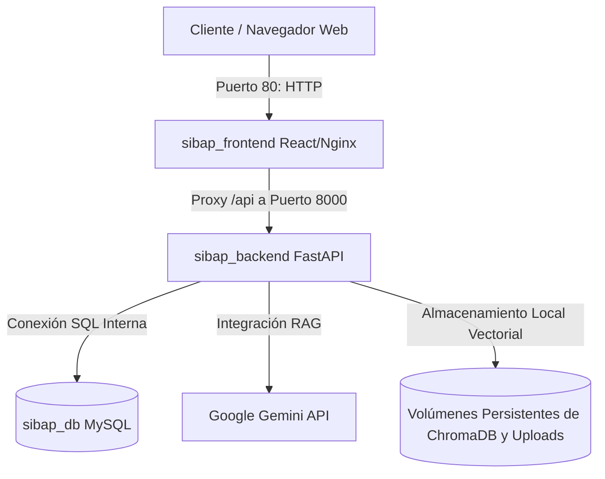

# Guía de Instalación, Configuración y Despliegue con Docker (SIBAP)

Esta guía detalla los pasos y requisitos necesarios para desplegar la plataforma **SIBAP** en un entorno de producción o local utilizando **Docker** y **Docker Compose**.

Esta es la forma **más rápida, sencilla y limpia** de realizar el despliegue de la aplicación completa.

---

## 🏗️ Arquitectura del Sistema con Docker

El ecosistema de SIBAP está compuesto por tres contenedores interconectados en una red interna privada:

1. **sibap_frontend**: Servidor **Nginx** optimizado que expone el puerto público `80` y sirve la aplicación SPA (Single Page Application) compilada en **React 19**.
2. **sibap_backend**: Servidor de API REST construido con **FastAPI** ejecutándose en Python 3.11 que procesa las peticiones de backend y se comunica con la IA.
3. **sibap_db**: Servidor de base de datos **MySQL 8.0** que almacena de manera persistente la información de la plataforma.



---

## 📋 Requisitos Previos

Solo se necesita tener instalado en el servidor o computadora local:
* **Git**
* **Docker**
* **Docker Compose**

> [!TIP]
> **En Ubuntu Linux**, se pueden instalar todos los requisitos rápidamente ejecutando:
> ```bash
> sudo apt update
> sudo apt install git docker.io docker-compose -y
> ```

---

## ✅ Lista de Verificación Antes de Comenzar

Antes de ejecutar cualquier comando, verificar que se cuenta con los siguientes archivos y datos:

| # | Qué se necesita | Origen | ¿Requiere modificación? |
|---|---|---|---|
| 1 | Repositorio clonado de GitHub | Se obtiene en el Paso 1 | ❌ No |
| 2 | Archivo `SIBAP_backend/.env` | **Proporcionado aparte** (no está en el repositorio por seguridad) | ✅ Sí — completar con credenciales reales |
| 3 | Archivo `db_sibap.sql` | **Proporcionado aparte** | ❌ No — se coloca en la raíz del proyecto |
| 4 | Archivo `docker-compose.yml` | Viene con el repositorio | ✅ Sí — ajustar contraseñas y URL del frontend |
| 5 | `SIBAP_backend/Dockerfile` | Viene con el repositorio | ❌ No se modifica |
| 6 | `SIBAP_frontend/Dockerfile` | Viene con el repositorio | ❌ No se modifica |
| 7 | `SIBAP_frontend/nginx.conf` | Viene con el repositorio | ❌ No se modifica |

> [!IMPORTANT]
> Los archivos `SIBAP_backend/.env` y `db_sibap.sql` **no se encuentran en el repositorio** y deben ser proporcionados por el equipo del proyecto. Sin ellos, la aplicación no podrá iniciarse.

---

## 🛠️ Paso 1: Clonar el Repositorio de GitHub

Clonar el repositorio oficial del proyecto e ingresar a la carpeta:

```bash
# Clonar el proyecto
git clone https://github.com/RaulNahuat/sibap.git

# Ingresar al directorio del proyecto
cd sibap
```

---

## 🛠️ Paso 2: Colocar los Archivos Necesarios

### 2.1 — Archivo de Variables de Entorno del Backend (`.env`)

El archivo `.env` **no está incluido en el repositorio** por razones de seguridad (contiene claves secretas y API Keys). Debe crearse dentro de la carpeta `SIBAP_backend/` con el nombre `.env`.

Se puede usar el archivo `SIBAP_backend/.env.example` como plantilla:

```bash
cp SIBAP_backend/.env.example SIBAP_backend/.env
```

A continuación, editar el archivo `SIBAP_backend/.env` y completar **todos** los valores:

```ini
# Configuración de la base de datos
# IMPORTANTE: usar 'db' como host (nombre interno del contenedor Docker), NO 'localhost'
DATABASE_URL=mysql+pymysql://TuUsuario:TuContrasena@db:3306/db_sibap

# Configuración de JWT y autenticación
# Generar una clave secreta larga y aleatoria (ej: openssl rand -hex 32)
SECRET_KEY=tu_clave_secreta_aqui
ALGORITHM=HS256
ACCESS_TOKEN_EXPIRE_MINUTES=30
COOKIE_NAME=access_token

# Configuración de IA (Google Gemini)
GOOGLE_API_KEY=tu_api_key_de_gemini_aqui
GOOGLE_AI_MODEL=gemini-1.5-flash
```

> [!CAUTION]
> **El host de la base de datos debe ser `db`** (nombre del contenedor de MySQL en Docker), **no `localhost`**. Si se deja `localhost`, el backend no podrá conectarse a la base de datos y fallará al iniciar.

### 2.2 — Archivo de Base de Datos (`db_sibap.sql`)

Colocar el archivo `db_sibap.sql` en la **carpeta raíz del proyecto** (al mismo nivel que `docker-compose.yml`). Docker lo detectará automáticamente e importará la base de datos al iniciar por primera vez.

```
sibap/
├── docker-compose.yml
├── db_sibap.sql          ← Colocar aquí
├── SIBAP_backend/
│   ├── .env              ← Creado en el paso anterior
│   └── ...
└── SIBAP_frontend/
    └── ...
```

---

## 🛠️ Paso 3: Configurar el `docker-compose.yml`

Abrir el archivo `docker-compose.yml` en la raíz del proyecto y ajustar únicamente los siguientes valores:

### 3.1 — Credenciales de la Base de Datos (servicio `db`)

```yaml
environment:
  MYSQL_DATABASE: db_sibap
  MYSQL_USER: TuUsuario            # ← Cambiar por el usuario real
  MYSQL_PASSWORD: TuContrasena     # ← Cambiar por una contraseña segura
  MYSQL_ROOT_PASSWORD: TuRootPass  # ← Cambiar por la contraseña del root
```

> [!IMPORTANT]
> El valor de `MYSQL_USER` y `MYSQL_PASSWORD` deben coincidir exactamente con los que se definieron en la variable `DATABASE_URL` dentro del archivo `SIBAP_backend/.env`.

### 3.2 — Variables del Frontend (servicio `frontend`)

```yaml
args:
  # URL pública del backend — cambiar por la IP del servidor o dominio real
  VITE_API_BASE_URL: http://localhost:8000

  # Correo de contacto que se mostrará en la plataforma
  VITE_EMAIL_ADRESS_CONTACT: correo@ejemplo.com
```

---

## 🚀 Paso 4: Levantar la Plataforma

Con todo configurado, ejecutar el siguiente comando desde la raíz del proyecto:

```bash
docker-compose up -d --build
```

Docker realizará automáticamente:
1. Descarga de la imagen oficial de MySQL 8.0 y configuración de la base de datos `db_sibap`.
2. Importación automática del archivo `db_sibap.sql`.
3. Creación del entorno del backend de FastAPI con todas sus dependencias de Python.
4. Compilación del frontend de React 19 y empaquetado en un servidor Nginx ligero.

Al finalizar, la plataforma estará disponible en:
* 🌐 **Plataforma Web (Frontend)**: `http://localhost` (Puerto 80)
* ⚙️ **API del Backend**: `http://localhost:8000` (Puerto 8000)

---

## 🔄 Importación Manual de la Base de Datos (Alternativa)

Si se necesita re-importar el archivo SQL después de que el contenedor ya esté en ejecución:

1. Copiar el archivo SQL dentro del contenedor de la base de datos:
   ```bash
   docker cp db_sibap.sql sibap_db:/tmp/db_sibap.sql
   ```
2. Ejecutar la restauración manualmente:
   ```bash
   docker exec -i sibap_db mysql -u TuUsuario -pTuContrasena db_sibap < db_sibap.sql
   ```
   *(Reemplazar `TuUsuario` y `TuContrasena` por los valores definidos en `docker-compose.yml`)*

---

## 📂 Estructura de Archivos Docker en el Proyecto

Los archivos que hacen posible este despliegue son:
* [docker-compose.yml](./docker-compose.yml): Orquestador principal de servicios, puertos y volúmenes.
* [SIBAP_backend/Dockerfile](./SIBAP_backend/Dockerfile): Configuración de construcción para FastAPI.
* [SIBAP_frontend/Dockerfile](./SIBAP_frontend/Dockerfile): Construcción multi-etapa para React y Nginx.
* [SIBAP_frontend/nginx.conf](./SIBAP_frontend/nginx.conf): Servidor de archivos estáticos y enrutamiento SPA.

---

## 🧰 Comandos Útiles de Mantenimiento

* **Ver estado de salud de los servicios**:
  ```bash
  docker-compose ps
  ```
* **Ver registros de logs en tiempo real**:
  ```bash
  docker-compose logs -f
  ```
* **Detener los servicios de forma segura (sin borrar datos)**:
  ```bash
  docker-compose stop
  ```
* **Apagar y eliminar los contenedores (conservando la base de datos)**:
  ```bash
  docker-compose down
  ```
* **Restablecer de fábrica (elimina todos los datos y volúmenes)**:
  ```bash
  docker-compose down -v
  ```
